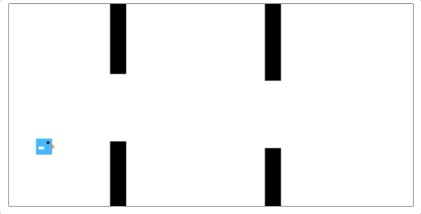

# mr-flap-js

[](https://travis-ci.org/pinussilvestrus/mr-flap-js)
[](https://greenkeeper.io/)
[](https://codecov.io/gh/pinussilvestrus/mr-flap-js)

Game 'Mr Flap' written in plain javascript - Work in progress




# Installation

Use the latest [bundled version](./dist/), a specific [release](https://github.com/pinussilvestrus/mr-flap-js/releases) or simply create your own bundle:

```sh
$ npm run build
```

Simply integrate the `js` and `css` source files inside your HTML document:

```html
<!DOCTYPE html>
<html>
    <head>
        <link rel="stylesheet" href="./mrflap.min.css">

        <script type="text/javascript" src="./mrflap.min.js"></script>
    </head>

    <body>

        <div class="mrflap-playground"></div>

    </body>
</html>
```

Make sure the `mrflap-playground` element is available to render the game inside.


# Development
```sh
$ npm i
$ npm run dev
```

# Testing
```sh
$ npm run test
```

## Commit Message Guidelines

* **feat**(new feature for the user, not a new feature for build script)
* **fix**(bug fix for the user, not a fix to a build script)
* **docs**(changes to the documentation)
* **style**(changes to css, styling, etc; no business logic change)
* **refactor**(refactoring production code, eg. renaming a variable)
* **test**(adding missing tests, refactoring tests; no production code change)
* **chore**(updating gulp tasks etc; no production code change)

## Definition of Done

See our [Definition of Done](https://github.com/pinussilvestrus/mr-flap-js/blob/master/DEFINITION_OF_DONE.md).
